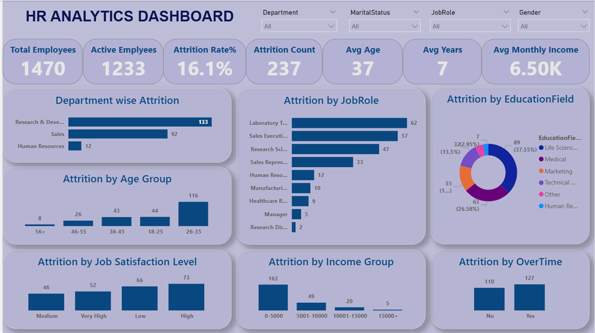

HR Analytics Dashboard – Employee Attrition Analysis
📌 About the Project

This project is an HR Analytics Dashboard built in Power BI to analyze employee attrition and 
understand the factors that may influence employees leaving the organization.

The idea behind this project was to explore HR data and identify patterns related to employee turnover.
By analyzing different employee attributes such as department, job role, age, salary, overtime, education, and job satisfaction,
I created an interactive dashboard that helps HR teams gain useful insights for improving employee retention.

🎯 Project Objective

The main objectives of this project were:

Analyze overall employee attrition.
Find departments and job roles with higher employee turnover.
Understand how age, salary, overtime, education, and job satisfaction relate to attrition.
Build an interactive dashboard for HR reporting.
Generate business insights that can support better retention strategies.
🛠️ Tools & Technologies Used
Power BI – Dashboard creation and data visualization
Power Query – Data cleaning and transformation
DAX – KPI calculations and custom measures
Microsoft Excel – Initial data review and validation
📂 Dataset

The dataset contains employee-level information, including:

Employee Age
Department
Job Role
Monthly Income
Education Field
Job Satisfaction
OverTime
Marital Status
Attrition Status
Years at Company
🧹 Data Cleaning & Preparation

Before creating the dashboard, I prepared the dataset by performing several data cleaning steps.

Checked and corrected data types
Reviewed missing values
Validated employee records
Removed inconsistencies where required
Created calculated columns for better analysis
Additional Columns Created

Age Group

18–25
26–35
36–45
46–55
56+

Income Group

0–5000
5001–10000
10001–15000
15000+

Job Satisfaction Level

Low
Medium
High
Very High
📊 KPI Metrics

The dashboard includes the following KPIs:

KPI	Description
Total Employees	Total employees in the dataset
Active Employees	Employees currently working
Attrition Count	Employees who left the company
Attrition Rate	Percentage of employees who left
Average Age	Average employee age
Average Years	Average years worked in the company
Average Monthly Income	Average employee salary
📈 Dashboard Analysis

The dashboard provides analysis across multiple HR dimensions:

Department-wise Attrition
Job Role-wise Attrition
Age Group-wise Attrition
Education Field-wise Attrition
Job Satisfaction-wise Attrition
Income Group-wise Attrition
Overtime-wise Attrition

Users can also filter the dashboard using:

Department
Job Role
Gender
Marital Status
💡 Key Insights

Some of the important observations from the dashboard are:

Research & Development recorded the highest employee attrition.
Laboratory Technicians experienced the highest attrition among all job roles.
Employees aged 26–35 years showed the highest turnover.
Employees who worked overtime had higher attrition compared to those who did not.
Most employees leaving the company belonged to the 0–5000 salary group.
Attrition was observed across all job satisfaction levels, indicating that employee turnover depends on multiple factors rather than a single reason.
📌 Business Recommendations

Based on the analysis, a few recommendations are:

Review workload and career growth opportunities in departments with high attrition.
Improve retention strategies for employees in the 26–35 age group.
Monitor overtime policies to improve work-life balance.
Re-evaluate compensation for lower salary groups.
Conduct regular employee feedback surveys to identify concerns before employees deci
